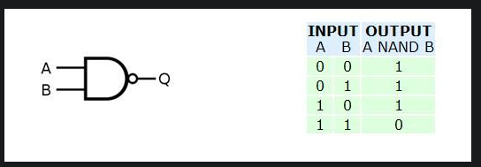
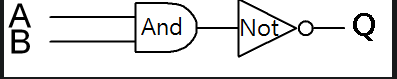
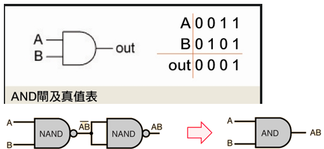

<!--
 * @Author: [lxp]
 * @Date: 2022-03-09 16:46:16
 * @LastEditors: [lxp]
 * @LastEditTime: 2022-03-09 17:23:41
 * @Description: 
-->
在课程中，使用了简化的HDL语言，其中的=是表示连接，而不是赋值。对各个基础门电路做介绍

Nand：最基础的电路门，电路中的与非门，，只有输入同时为1的情况下，输出才会为0，即输入有一个0，则输出为0

And：与门，只有输入同时为1时，输出为1

And16：将16位每一位都And

DMux：解多工器，将一组输入信号从多组输出端中选择一组发送出去，属于一对多的电路。解码信号，选择设备输出

Mux
