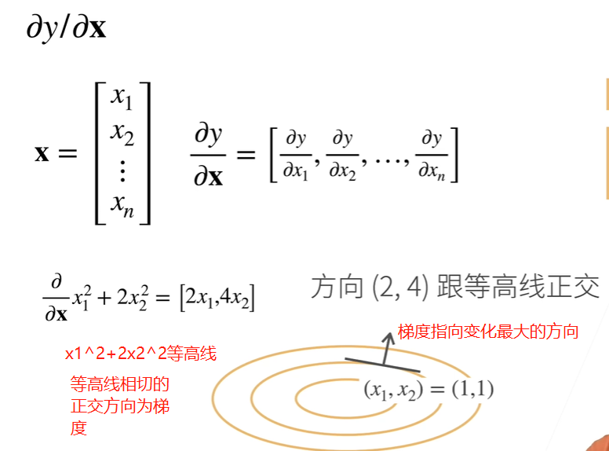
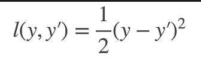
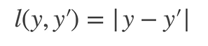
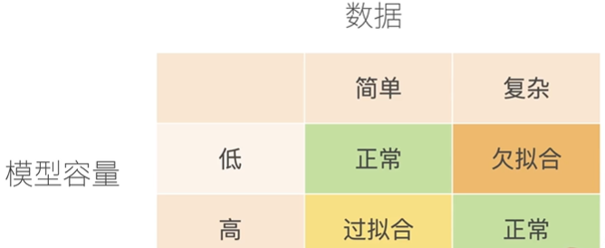
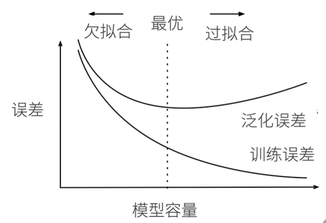

<!--
 * @Description: 
 * @Version: 2.0
 * @Autor: lxp
 * @Date: 2021-07-07 00:34:17
 * @LastEditors: lxp
 * @LastEditTime: 2021-07-26 21:06:19
-->
教材：[动手学深度学习](https://zh-v2.d2l.ai/index.html)

1、梯度指向变化最大的方向 -- 核心思想

自动求导：计算图、链式法则、反向传播(计算复杂度O(N)，空间复杂度O(N))

2、线性回归

loss = 1/2 (y - yi) ^ 2

3、优化方法

3.1 梯度下降：挑选一个初始值w0，重复迭代次数，沿梯度方向增加损失函数值

学习率：，太小--学习效果有限，计算消耗太大，太大--振荡，学习不到优化

3.2 小批量随机梯度下降：随机采样b个样本来近似损失，不能太小，不能太大

学习率，批量 -- **超参数**

4、softmax回归 -- 交叉熵损失

多分类问题

**5、损失函数**

L2-LOSS：

L1-LOSS:

带来稳定性，权重更新慢；0处不可导

6、训练误差和泛化误差

**训练误差：**：模型在训练数据上的误差

**泛化误差：**：模型在新数据上的误差

验证数据集：用来评估模型好坏的数据集

测试数据集：只用一次的数据集

K交叉验证：

过拟合欠拟合

VC维：多层感知机VC维O(NlogN)，在深度学习中很少使用，很难计算

过拟合：权重衰退 -- 通过L2正则项使得模型参数不会过大，从而控制模型复杂度， lamada是超参数

方法一： min loss(w,b) 约束 ||w||^2 <= theta

方法二： min loss(w, b) + lamada / 2 ||w||^2

7、丢弃法 -- Dropout

8、梯度爆炸

权重初始化：合理区间内随机初始化参数

Xavier初始化；normal初始化

w初始化全为0，很可能直接导致模型失效，无法收敛