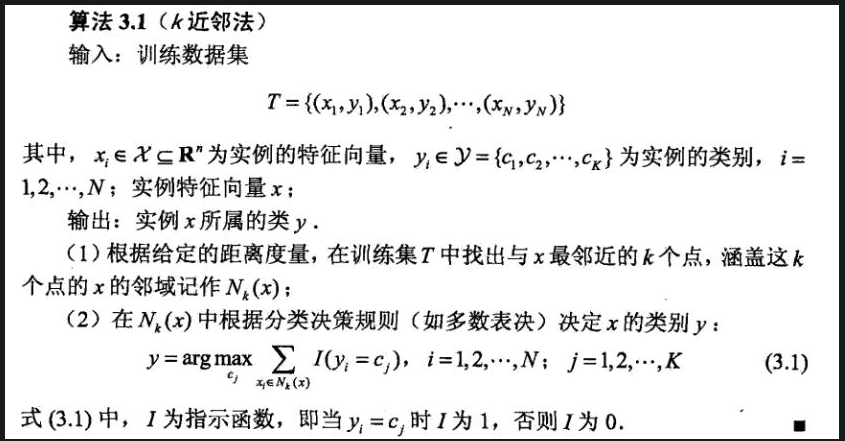
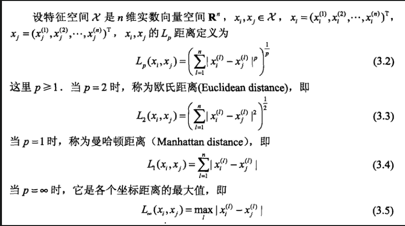

<!--
 * @Description: 
 * @Version: 2.0
 * @Autor: lxp
 * @Date: 2021-07-03 15:09:31
 * @LastEditors: lxp
 * @LastEditTime: 2021-07-03 16:43:51
-->
**K近邻**并没有显式的学习过程，也就是不需要对训练集进行学习。预测过程中直接遍历预测点与所有点的距离，并找到最近的K个点即可。找到K个最近点后，使用多数表决（即投票）的方式确定预测点的类别。

距离度量：

# KD树算法
解决K近邻算法缺点：
1、在预测样本类别时，待预测样本需要与训练集中所有样本计算距离，当训练集数量过高时（例如Mnsit训练集有60000个样本），每预测一个样本都要计算60000个距离，计算代价过高，尤其当测试集数目也较大时（Mnist测试集有10000个）。

1、K近邻在高维情况下时（高维在机器学习中并不少见），待预测样本需要与依次与所有样本求距离。向量维度过高时使得欧式距离的计算变得不太迅速了。本文在60000训练集的情况下，将10000个测试集缩减为200个，整个过程仍然需要308秒（曼哈顿距离为246秒，但准确度大幅下降）。

使用欧氏距离还是曼哈顿距离，性能上的差别相对来说不是很大，说明欧式距离并不是制约计算速度的主要方式。最主要的是训练集的大小，每次预测都需要与60000个样本进行比对，同时选出距离最近的K项。

## Kd-tree应用
**在广告索引搜索中有应用**
想象一下我们有如下两个任务:

我现在想骑一辆小黄车，我想查找离我最近的k辆小黄车.

找到百度地图中显示在屏幕上区域中的所有酒店这两个任务均可以用kd-tree来解决

kd-tree 主要两个用途:

查询离某个点的最近的 个邻居,

搜索某个区域内的所有点.后者在计算几何中称为范围查询,例如查询某个平面区域内的点的个数.