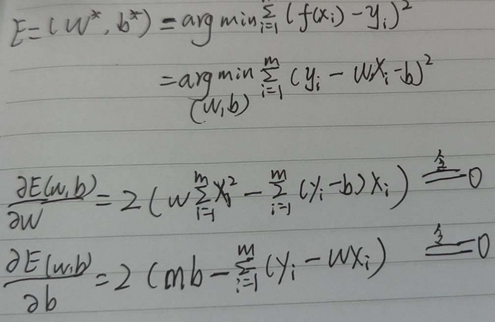
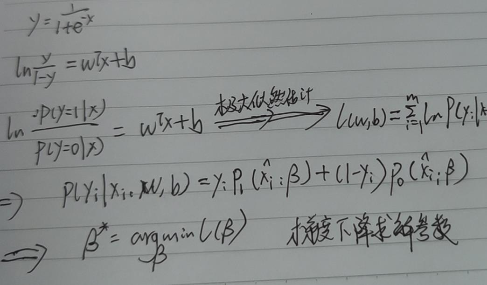

<!--
 * @Description: 
 * @Version: 2.0
 * @Autor: lxp
 * @Date: 2021-09-03 15:22:40
 * @LastEditors: lxp
 * @LastEditTime: 2021-09-03 16:13:37
-->
1、基本形式

$f(x)=w_1x_1 + w_2x_2 + ... + w_dx_d + b$ 一般写成向量形式 $f(x)=w^Tx+b$

线性模型具有很好的可解释性

2、线性回归

2.1 如何确定w和b？使用最小二乘的参数估计

2.2 均方误差有极好的集合意义，对应常用的欧式距离。可以使用最小二乘法

3、对数几率回归--逻辑回归

对数几率函数--Sigmoid函数: $y= \frac{1}{1+e^{-z}}$

4、线性判别分析 -- LDA

**思想：** 给定训练样本集合，设法将样例投影到一条直线上，使得同类样例的投影点尽可能接近，异样投影点尽可能远离

5、多分类学习

5.1 将多分类任务拆为若干个二分类任务求解

6、类别不平衡问题

解决办法：欠采样(去除一些样本，使得正反数目接近)、过采样(增加一些样本，使得正反数目接近)、再缩放、权重设置、损失函数设置