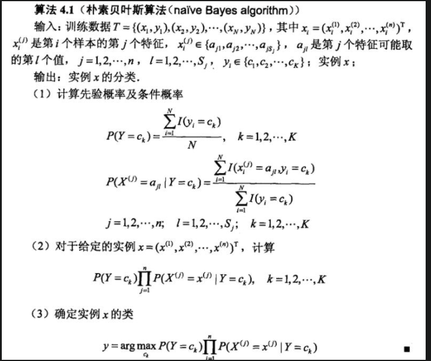

<!--
 * @Description: 
 * @Version: 2.0
 * @Autor: lxp
 * @Date: 2021-07-04 13:39:07
 * @LastEditors: lxp
 * @LastEditTime: 2021-07-04 14:49:45
-->
三种常见的贝叶斯模型: 
1、多项式模型（MultinomialNB）：多项式朴素贝叶斯常用语文本分类，特征是单词，值时单词出现的次数。平滑处理，具体公式为

2、高斯模型（GaussianNB）：当特征是连续变量的时候，假设特征分布为正态分布，根据样本算出均值和方差，再求得概率

3、伯努利模型（BernoulliNB）：伯努利模型适用于离散特征的情况，伯努利模型中每个特征的取值只能是1和0。

**先验概率**是指根据以往经验和分析得到的概率,如全概率公式,它往往作为"由因求果"问题中的"因"出现.

**后验概率**是指依据得到"结果"信息所计算出的最有可能是那种事件发生,如贝叶斯公式中的,是"执果寻因"问题中的"因".

判别模型：相当于有一个分割线、分割超平面

生成模型：生成式模型求得概率分布

书中讲解的生成模型不多，生成模型学习联合概率分布，NB是典型的生成模型，与之对应的判别模型

