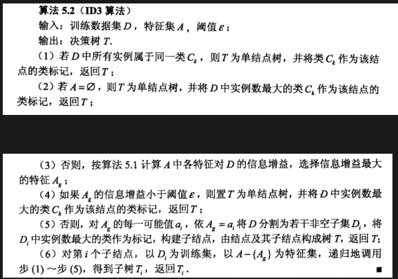

<!--
 * @Description: 
 * @Version: 2.0
 * @Autor: lxp
 * @Date: 2021-07-04 15:15:19
 * @LastEditors: lxp
 * @LastEditTime: 2021-07-04 16:34:09
-->
CART算法之前的章节说的都是分类树，ID3和C4.5都只能处理分类问题，从CART(Classification and Regression Tree)开始有回归树，统称为决策树,CART发表的时间顺序为CART->ID3->C4.5

