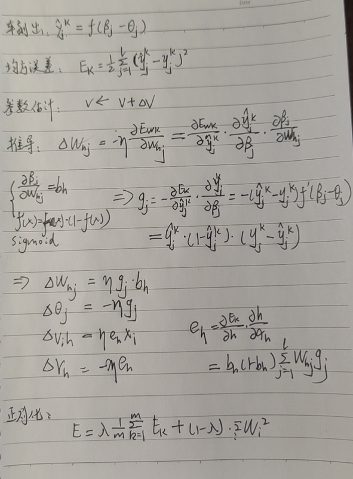

<!--
 * @Description: 
 * @Version: 2.0
 * @Autor: lxp
 * @Date: 2021-09-04 14:31:46
 * @LastEditors: lxp
 * @LastEditTime: 2021-09-04 14:48:12
-->
2、感知机与多层网络

3、误差逆传播算法

防止过拟合策略：early stopping, regularization(正则化)

4、全局最小与局部极小