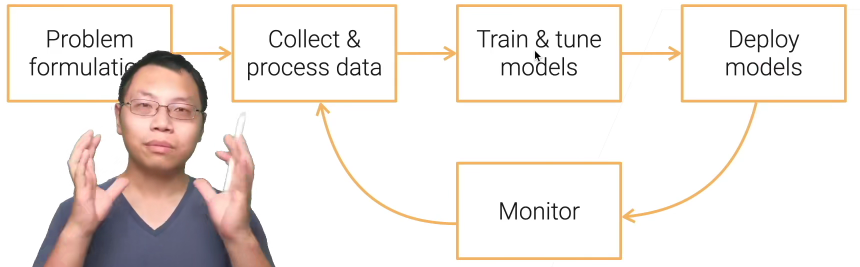
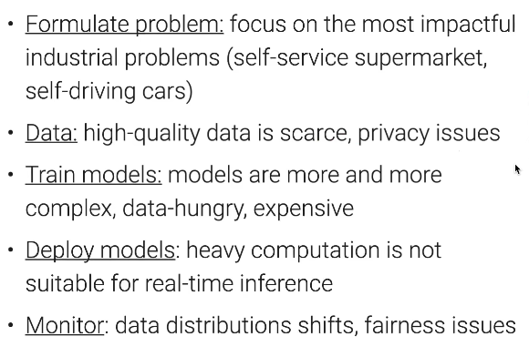
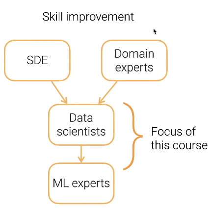
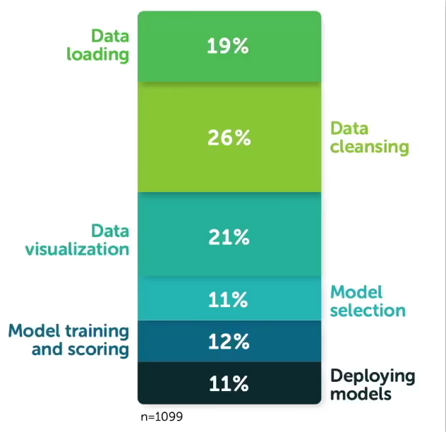
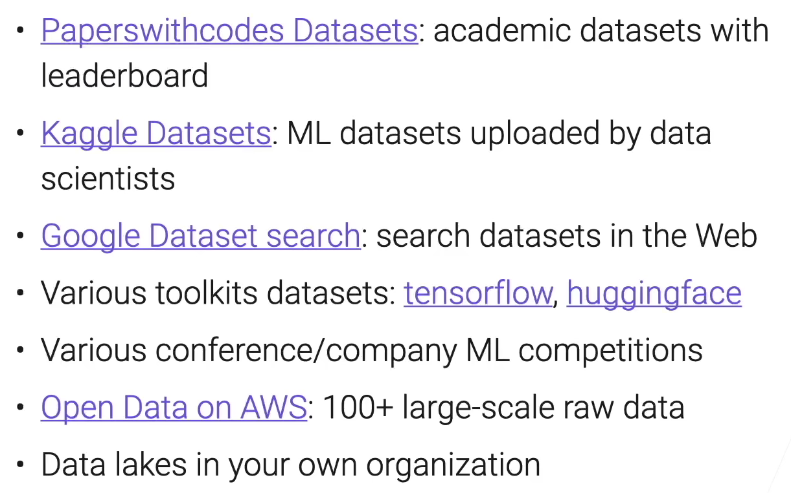

<!--
 * @Description: 
 * @Version: 2.0
 * @Autor: lxp
 * @Date: 2021-10-27 16:57:12
 * @LastEditors: lxp
 * @LastEditTime: 2021-10-27 20:37:48
-->
# 1.1 课程介绍

**目的**  数据科学家的在工业界部署模型，实现算法的一些细节

挑战：

**角色**

Domain Experts(领域专家): 商业直觉，知道哪些数据重要，数据在哪里，定义模型影响

Data Scientists(数据科学家): 全栈的数据挖掘，模型训练和部署

ML experts(机器学习专家): 本土化 SOTA ML 模型

SDE(软件开发工程师)：开发维护data pipelines，模型服务pipelines

# 1.2 数据获取

# 1.3 爬数据

# 1.4 标注数据

花钱标注、自监督、主动学习、自训练、数据变成
