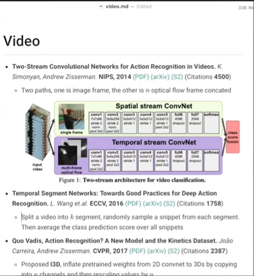

<!--
 * @Description: 
 * @Version: 2.0
 * @Autor: lxp
 * @Date: 2021-07-26 15:25:30
 * @LastEditors: [lxp]
 * @LastEditTime: 2022-01-20 23:39:51
-->

[李沐](https://github.com/mli/paper-reading)

```
第一遍
	读摘要是否相关，直接跳到结论，然后看看实验部分--方法图表等，决定是否要通读一遍
第二遍
	标题一直读到最后，不需要太在意细节，主要弄清楚图表的含义，方法流程图，算法图等等
第三遍
	提出什么问题，解决这个问题，自己会怎么做，整个过程是什么样
进行复现--应用等

读论文：
对1-2个研究方向很了解，最重要论文的反复研读，重复实验

对5-10个研究方向的最新进展 -- 工作后
```
